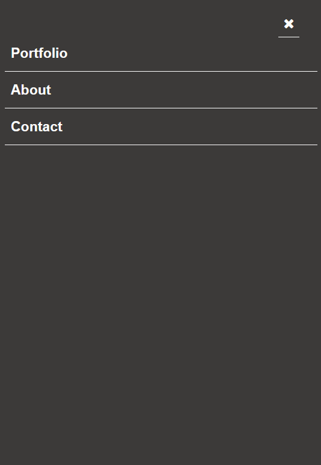

# Project Name

-Portfolio: Mobile Menu

# Getting Started
-To get a local copy up and running follow these simple example steps.

## Getting Started

- To get a local copy up and running follow these simple example steps.

### Prerequisites

- You only need a browser to run the html file in.

### Setup

- Create a new folder to store the files in.

### Install

- Open your command prompt or terminal and run.
- git clone https://github.com/telanet/Portfolio.git .

### Run tests

- To run tests run :
- npx hint .
- npx stylelint "**/*.{css,scss}"

### Deployment

- Project is deployed using
- git push <branch_name>

## Built With

- HTML
- CSS

### Prerequisites
-Git
-VS Code
-Linters

## Authors

👤 **Author1**

- GitHub: [@telanet](https://github.com/telanet)

- Twitter: [@Ben54647605](https://twitter.com/Ben54647605)

👤 **Author2**

- GitHub: [@Cluab](https://github.com/ofarouq310)

## 🤝 Contributing

This project welcomes contributions.

Feel free to check the [issues page](../../issues/).

## Show your support

Give a ⭐️ if you like this project!

## Acknowledgments

- Hat tip to anyone whose code was used
- Inspiration
- etc

## 📝 License
MIT
