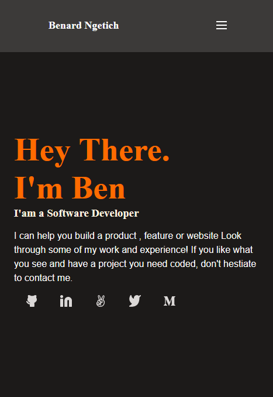

# MOBILE SKELETON PORTFOLIO

> A "Mobile skeleton portfolio" HTML-5 & CSS3 repository.

It is a show of my understanding of Gitflow, use of Linters, HTML5 semantics, CSS3 flexbox and figma.

## Built With

- HTML-5
- CSS3
- Linters
- Figma
## Getting Started

- To get a local copy up and running follow these simple example steps.

### Prerequisites

- You only need a browser to run the html file in.

### Setup

- Create a new folder to store the files in.

### Install

- Open your command prompt or terminal and run.
- git clone git@github.com:telanet/My-Portfolio.git .

### Run tests

- To run tests run :
- npx hint .
- npx stylelint "**/*.{css,scss}"

### Deployment

- Project is deployed using
- git push <branch_name>

## Authors

👤 **Benard Ngetich**

- GitHub: [@telanet ](https://github.com/telanet)
- Twitter: [@Ben54647605](https://twitter.com/Ben54647605)

## 🤝 Contributing

Contributions, issues, and feature requests are welcome!

Feel free to check the [issues page](https://github.com/telanet/My-Portfolio).

## Show your support

Give a ⭐️ if you like this project!

## 📝 License

This project is [MIT](./MIT.md) licensed.